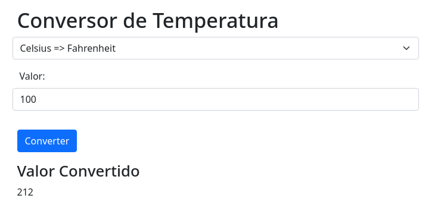

# Iniciativa Kubernets - Conversão Temperatura

## Sobre

Consiste em uma aplicação web que realiza a conversão de temperatura de celsius para fahrenheit.

## Como Executar

1. Para rodar a aplicação basta ter o Docker instalado na máquina, e rodar o comando `docker image build -t sonnymarinho/image-to-repository:v1 .` dentro da pasta **src/** (mesmo local onde se encontra o arquivo Dockerfile) para gerar a imagem.

2. Logo em seguida, basta criar um container com a imagem criada pelo comando anterior, fazendo _bind_ da porta utilizada pela aplicação (8080) para a porta local.

   ```bash
   # Criação do Container
   # -d (detached) | -p (publish)
   docker container run -d -p 8080:8080 sonnymarinho/image-to-repository:v1
   ```

   Caso queira verificar se o container está ativo, basta executar `docker ps`.

3. Criando a imagem e colocando a aplicação para funcionar, a aplicação deve etar disponível para ser acessada localmente no endereço `http://localhost:8080/`


